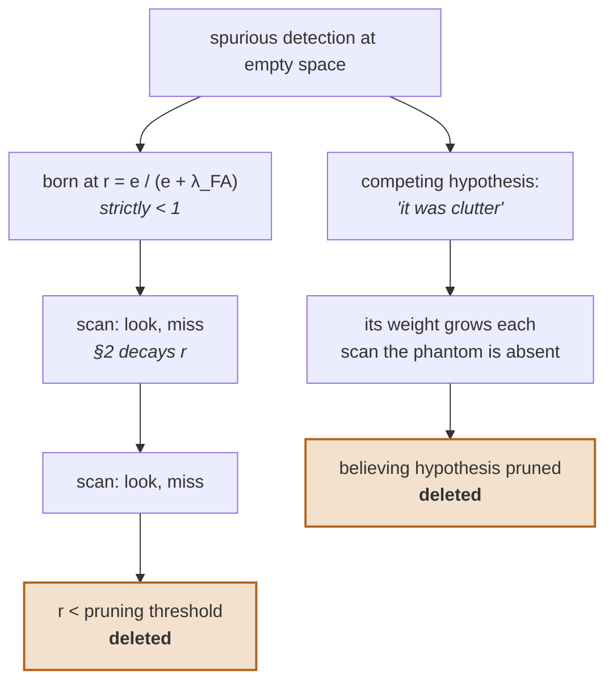

<!--
MIRROR OF A THESIS VAULT NOTE - DO NOT EDIT THIS FILE.
Source of truth: A2 Bernoulli existence update.md (Obsidian vault, 2_Project/2_2_Derivations/).
Edit there, then re-run scripts/sync_derivations.py --update --vault <path>.
-->

# A2 - Bernoulli existence update

Mirror copied 2026-09-23 from `A2 Bernoulli existence update.md` (source sha256 `74aac8c7ede5`).
Cite this note in code as `[A2 §<section>]`.
**If the code and this file disagree, the vault note wins: stop and ask the author.**

---

# Source

**Source:** …

# Bernoulli existence update

First derivation done under Derivation framework. Derives, from Bayes' rule alone:

> [!NOTE] Claim
>What happens to a single potential object's existence probability when it is missed, when it is detected, and when it is born from a measurement — and shows why a false positive is only ever deletable if it was ***never*** born **certain**.
## 1. Model

A **Bernoulli RFS** is the smallest object in the RFS family that still has the feature of interest — existence. Its state space has exactly two entries:
$$p(X) = \begin{cases} 1-r & X = \emptyset \\[2pt] r\,p(x) & X = \{x\} \end{cases}$$
Two things carried forward: 
- a scalar $r$ (*does it exist?*) 
- a density $p(x)$ (*where is it?*). 
A Kalman filter only ever carried the second.

**Sensor model:**

| Symbol                   | Meaning                                                                                                                                                          |
| ------------------------ | ---------------------------------------------------------------------------------------------------------------------------------------------------------------- |
| $p_D(x)$                 | probability of detecting an object at $x$, , a _likelihood function_, indexed by state, **not** **a** **density** on state.                                      |
| $\bar p_D$               | $\int p_D(x)p(x)dx$, $\bar p_D=\mathbf{E}_{p(x)}[p_D(x)]$                                                                                                        |
| $g(z\mid x)$             | likelihood of reading $z$ from an object at $x$                                                                                                                  |
| $\lambda_{\text{FA}}(z)$ | clutter (false-alarm) intensity                                                                                                                                  |
| $\lambda_u(x)$           | Poisson intensity of objects that exist but have never been detected                                                                                             |
| $r$                      | Odds: A dynamic existence scalar to adhere Cromwell’s rule for detection uncertainty (probability that the object exists, given that you looked and saw nothing) |

Shorthand used throughout: $\bar p_D = \int p_D(x)\,p(x)\,dx$, the detection probability averaged over where the object is currently believed to be.

## 2. Misdetection update

No measurement is assigned to this component. Likelihood of that outcome, per branch:

- $X = \emptyset$ — nothing there, seeing nothing has probability $1$
- $X = \{x\}$ — something there, seeing nothing has probability $1 - p_D(x)$

**Unnormalized posterior:**
$$P(\emptyset) \propto (1-r)\cdot 1, \qquad P(\{x\}) \propto r\,p(x)\bigl(1-p_D(x)\bigr)$$
here $1-p_D(x)$ is the likelihood of a null measurement in the branch $\mathbf{X}=\{x\}$ (branch 2), since $p_D(x)$ is the likelihood of detecting an object at $x$. 

**Normalizer:**
$$(1-r) + r\!\int\! p(x)\bigl(1-p_D(x)\bigr)dx = (1-r) + r(1-\bar p_D) = 1 - r\,\bar p_D$$
**Result:**
$$\boxed{\;r^+ = \frac{r\,(1-\bar p_D)}{1 - r\,\bar p_D}, \qquad p^+(x) = \frac{p(x)\bigl(1-p_D(x)\bigr)}{1-\bar p_D}\;}$$
The posterior probability $r^+$ reads as, and object is present ($r$) but missed detecting it ($1-\bar p_D$), **look-and-miss**. This is normalized over the probability of there not existing an object.

The posterior density $p^+$ reads as, the density of an existing object ($p^+$) but was missed detecting ($1-p_D$). Normalized over where the object might be.

**Reading it:**
This expression is what the RFS note meant by 

>*existence probability gives a principled way to confirm and delete tracks — no ad hoc confidence threshold needed.* 

The threshold is replaced by that fraction, which decays $r$ a little on every look-and-miss.

**Numerically:** 
$$P(\emptyset) \propto (1-0.9)=0.1, \qquad P(\{x\}) \propto 0.9\,p(x)\bigl(1-0.9\bigr)=0.09p(x)$$
$p_D = 0.9$, $r = 0.9$ gives the *posterior probability that the object exists, given that you looked and saw nothing*, $r^+ \approx 0.47$. One clean miss nearly halves belief in the object.

**Extreme checks.**

- $p_D$ constant in $x$ → it cancels in $p^+$, so the position estimate does not move at all; only existence decays.
- $p_D$ varying in $x$ → the miss also *reshapes* $p(x)$, pushing probability mass toward places the object would not have been seen anyway (occlusion, grazing viewing angle). This is exactly the viewpoint- and occlusion-dependent $p_D$ proposed in Response to Duarte and Menno, and it is the mechanism that extension buys.
- $r = 1$ → $r^+ = (1-\bar p_D)/(1-\bar p_D) = 1$. **Absorbing.** See §5.

### 2.1 Why $\bar p_D$ and not $p_D(x)$

**What it is.** $\bar p_D = \int p_D(x)\,p(x)\,dx$ is the detection probability *marginalized over the current belief about position* — a scalar, not a function. It is the prior-predictive probability of detecting the object, and $1-\bar p_D$ is therefore the likelihood of the null measurement under the branch "the object exists".

**Why the average is forced, not chosen.** The existence scalar $r$ lives outside the state space: updating it needs a *number*. The normalizer supplies exactly one,

$$\int p(x)\bigl(1-p_D(x)\bigr)dx = 1-\bar p_D ,$$

so the position-dependence of $p_D(x)$ is integrated out of the existence update by the algebra itself. Nothing is approximated here. It also means existence evidence is filtered through *localization* uncertainty: a miss only counts against existence to the extent you believed you were looking in the right place. In odds form,

$$\frac{r^+}{1-r^+} = \frac{r}{1-r}\,(1-\bar p_D),$$

so $1-\bar p_D$ is the Bayes factor of one **look-and-miss**, and $k$ consecutive misses at roughly constant $\bar p_D$ decay the odds as $(1-\bar p_D)^k$, consequently decaying $r$. That "roughly constant" is doing more work than it looks — §2.2 shows it is never exactly true and always errs in the same direction.

Using $p_D(x)$ *pointwise* in the $r$ update — evaluating it at the mean, $p_D(\hat x)$ — is a plug-in approximation, and it is only exact when $p_D$ is constant over the support of $p(x)$. $p_D(x)$ still appears in full in $p^+(x)$, where it belongs: the position update is where the shape information survives.

**Example (crop row, partial occlusion).** Take $r = 0.9$ and a belief split evenly between a clear view and a leaf-occluded pose, $p_D = 0.9$ vs $p_D = 0.2$:

$$\bar p_D = 0.5\cdot0.9 + 0.5\cdot0.2 = 0.55 \;\Rightarrow\; r^+ = \frac{0.9\cdot0.55}{1-0.9\cdot 0.55} \approx 0.98$$

The plug-in alternative, evaluating $p_D$ at the visible pose only, gives $r^+ \approx 0.47$ — the same single miss nearly halves belief in a crop that was probably just behind a leaf. Averaging is what keeps an occluded-but-real plant alive long enough to be re-detected; see Noisy detections.

### 2.2 $\bar p_D$ carries a time index, and a miss streak is not geometric

§2.1 established $\bar p_D = \mathbf{E}_{p(x)}[p_D(x)]$. The consequence not yet drawn: 

>the expectation is taken against the *current* density, so $\bar p_D$ inherits the time index that $p$ has. $p_D(\cdot)$ is the constant here — same detector every scan, fixed function of state. $\bar p_D^{(k)}$ is a property of the **belief**, and the belief moves.

**The coupled recursion.** Writing out §2 with indices, a streak of $k$ misses is:

$$\bar p_D^{(k)} = \int p_D(x)\,p_k(x)\,dx, \qquad p_{k+1}(x) = \frac{p_k(x)\bigl(1-p_D(x)\bigr)}{1-\bar p_D^{(k)}}$$

The second line feeds the first. So the honest odds recursion is a **product of distinct factors**, not a power:

$$\frac{r_k}{1-r_k} = \frac{r_0}{1-r_0}\prod_{j=0}^{k-1}\bigl(1-\bar p_D^{(j)}\bigr) \;\;\neq\;\; \frac{r_0}{1-r_0}\bigl(1-\bar p_D\bigr)^{k}$$

$(1-\bar p_D)^k$ is the special case in which every factor happens to be equal.

**How far apart are the factors?** Write $\mathbf{E}$ for expectation under $p_k$. From the update above,

$$\bar p_D^{(k+1)} = \frac{\mathbf{E}\bigl[p_D(1-p_D)\bigr]}{\mathbf{E}\bigl[1-p_D\bigr]} = \frac{\mathbf{E}[p_D]-\mathbf{E}[p_D^2]}{1-\mathbf{E}[p_D]}$$

Subtracting from $\bar p_D^{(k)} = \mathbf{E}[p_D]$, the numerator collapses to $\mathbf{E}[p_D^2]-\mathbf{E}[p_D]^2$:

$$\boxed{\;\bar p_D^{(k)} - \bar p_D^{(k+1)} = \frac{\operatorname{Var}_{p_k}\bigl(p_D(x)\bigr)}{1-\bar p_D^{(k)}}\;}$$

**Three consequences, all immediate:**

1. **Variance is non-negative, so $\bar p_D^{(k)}$ is monotonically non-increasing under a miss streak.** The Bayes factors $1-\bar p_D^{(j)}$ therefore *climb* toward $1$, never fall. **A track's decay self-slows: every miss makes the next miss weaker evidence against existence.** $(1-\bar p_D^{(0)})^k$ is a *lower bound* on survival, never an estimate of it.
2. **Equality holds iff $\operatorname{Var} = 0$**, i.e. $p_D$ constant over the support of $p_k$. That is the first extreme check of §2, recovered as the degenerate case rather than a separate observation. The geometric model is exact only for a state-independent detector.
3. **The driver is the *variance*, not the mean.** How long a component survives a miss streak is governed by how much detectability *disagrees across the positional uncertainty*. The process also destroys its own variance — mass concentrates on the least-detectable region — so $\bar p_D^{(k)} \to \min_{x \in \operatorname{supp} p} p_D(x)$ and the factor converges to $1 - \min p_D$.

**Worked example.** Two candidate poses for a single plant 

> [!NOTE] Uncertainty is constructed independent of the source of obstruction
>a tomato or potato in a row; the mechanism is not specific to canopy occlusion — an oblique viewing angle, a pose at the frame edge, or a neighbouring plant in the line of sight all produce the same structure.

$p_D = 0.9$ in the high-visibility pose, $p_D = 0.2$ in the low-visibility one, belief initially even, $r_0 = 0.9$. Detector unchanged throughout; the robot looks $k$ times and never detects.

| $k$ | $p_k(\text{high-vis})$ | $p_k(\text{low-vis})$ | $\bar p_D^{(k)}$ | factor $1-\bar p_D^{(k)}$ | $r_k$ | $r_k$ if $\bar p_D^{k}=0.45$ |
| --- | ---------------------- | --------------------- | ---------------- | ------------------------- | ----- | ---------------------------- |
| 0   | 0.500                  | 0.500                 | 0.550            | 0.450                     | 0.900 | 0.900                        |
| 1   | 0.111                  | 0.889                 | 0.278            | 0.722                     | 0.802 | 0.802                        |
| 2   | 0.015                  | 0.985                 | 0.211            | 0.789                     | 0.745 | 0.646                        |
| 3   | 0.002                  | 0.998                 | 0.201            | 0.799                     | 0.698 | 0.451                        |
| 4   | 0.000                  | 1.000                 | 0.200            | 0.800                     | 0.648 | 0.270                        |
| 5   | 0.000                  | 1.000                 | 0.200            | 0.800                     | 0.596 | 0.142                        |
| 6   | 0.000                  | 1.000                 | 0.200            | 0.800                     | 0.541 | 0.070                        |

Read the columns in this order:

- **Positional belief collapses first, and fast.** Each miss multiplies the high-visibility pose by $0.1$ and the low-visibility one by $0.8$, so their ratio falls as $(0.1/0.8)^k$. By $k=3$ the object is, for practical purposes, believed to be exactly where it cannot be seen. This is the reshaping already noted in §2's second extreme check — here quantified.
- **$\bar p_D^{(k)}$ follows it down**, $0.550 \to 0.278 \to 0.211 \to 0.200$, converging on the low-visibility pose's own $p_D$, as consequence 3 predicts. The drops match $\operatorname{Var}_{p_k}(p_D)/(1-\bar p_D^{(k)})$ exactly: $0.2722,\ 0.0670,\ 0.0094,\ 0.0012$.
- **So the evidence per miss weakens**, $0.450 \to 0.722 \to 0.789 \to 0.800$.
- **And $r$ decays far more slowly than the geometric model claims.** Misses needed to drive $r$ from $0.9$ below a pruning threshold of $0.1$: **6** under the geometric model, **17** under the true recursion.

**Reading it.** The mechanism is the filter behaving correctly, not a pathology. "I looked and saw nothing" is weak evidence precisely when you have already concluded the object is somewhere you could not have seen it, and the filter reaches that conclusion by itself after very few misses. That is what protects a real plant that is genuinely obscured. It is also, unavoidably, what protects a phantom — see the amendment in §5.

## 3. Detection update

A measurement $z$ arrives and, *under this association hypothesis*, this component produced it, i.e. the measurement came from an object *already tracked*.

The phrase "under this hypothesis" is doing all the work — it is the conditioning move from Derivation framework - The one structural idea.

Ask each branch whether it could have produced $z$:

$$P(\emptyset \mid z) \propto (1-r)\cdot \underbrace{0}_{\substack{\text{this hypothesis has already}\\ \text{assigned } z \text{ to this component}}} = 0$$
$$P(\{x\} \mid z) \propto r\,p(x)\,p_D(x)\,g(z\mid x)$$

That zero is **not** "nothing there, nothing to measure" — nothing-there still produces measurements, at rate $\lambda_{\text{FA}}(z)$. The zero comes from the *conditioning*: this hypothesis has already spent $z$ on this component, so the clutter explanation is not unavailable, it lives in a **different** hypothesis (§4). Change the conditioning and this entry changes with it. This is the §3 $\to$ §4 handoff, and it is the reason §4 follows rather than merely appears.

The empty branch, $P(\emptyset)$, is annihilated — not shrunk, zeroed. So after normalising:
$$\boxed{\;r^+ = 1, \qquad p^+(x) = \frac{p_D(x)\,g(z\mid x)\,p(x)}{\displaystyle\int p_D(x')\,g(z\mid x')\,p(x')\,dx'}\;}$$

**Reading it.** With $p_D$ *constant* it cancels top and bottom, leaving $p^+(x) \propto g(z\mid x)\,p(x)$ — plain Bayes. With $g$ linear-Gaussian and $p$ Gaussian, that *is* the Kalman update, character for character.

So: **conditional on an association hypothesis, and with $p_D$ constant, a PMBM update is a Kalman update with a scalar riding along, and the scalar is pinned at 1.** Everything genuinely expensive in PMBM lives in the weights *between* hypotheses, never inside one.

**The constant-$p_D$ clause is not a footnote.** §2.1 and §2.2 spent their whole argument establishing that $p_D(x)$ *varies* — viewpoint, occlusion, range — and that this variation is what the extension buys. With $p_D$ non-constant, $p^+(x) \propto p_D(x)\,g(z\mid x)\,p(x)$ is a Kalman update **times a state-dependent reweighting**, and is not Gaussian. The clean sentence above therefore holds exactly in the regime this note has already argued against, and the implementation will need an approximation — moment matching, or a particle representation — at precisely this step. Carried to §7.

**Where the denominator goes.** Multiplied by $r$, that normaliser becomes the weight of the hypothesis *"this component produced $z$"* when it competes against *"$z$ was clutter"* and *"$z$ is a new object"*. This is the seam where the combinatorics enter — the thing Murty's algorithm and Gibbs sampling exist to manage (see Managing hypothesis growth).

### 3.1 What $r^+ = 1$ is, and what it is not

§5 shows $r = 1$ is absorbing. §3 hands out $r = 1$ on every detection. Both are true and they do not collide, because **Cromwell's rule bites the *branch*, not the component.**

After one measurement the Bernoulli does not become a Bernoulli with some mixed $r$. It grows a second **local hypothesis**: the filter now carries two (weight, component) pairs.

| branch       | weight                                                          | $r$                                  | density $\propto$          |
| ------------ | --------------------------------------------------------------- | ------------------------------------ | -------------------------- |
| **detected** | $r\,\ell(z), \quad \ell(z) = \int p_D(x)\,g(z\mid x)\,p(x)\,dx$ | $1$                                  | $p_D(x)\,g(z\mid x)\,p(x)$ |
| **missed**   | $(1 - r\,\bar p_D)\cdot\lambda_{\text{FA}}(z)$                  | $\dfrac{r(1-\bar p_D)}{1-r\bar p_D}$ | $p(x)\bigl(1-p_D(x)\bigr)$ |

The $\lambda_{\text{FA}}(z)$ on the second row is not decoration — it is what makes the two weights comparable. Branch 1 explains $z$; branch 2 must still explain it, from clutter. Drop that factor and a likelihood is being compared against a probability. 

§4 supplies the third competitor: $z$ from an object that exists but was never detected.

The reported existence probability is a weighted average over this table:

$$r_{\text{marg}} = \frac{w_{\text{det}}\cdot 1 + w_{\text{miss}}\,r^+_{\text{miss}}}{w_{\text{det}} + w_{\text{miss}}} \;<\; 1 \quad\Longleftrightarrow\quad \lambda_{\text{FA}}(z) > 0$$
the same condition §4 identifies, reached from the other side. Certainty is absorbing *inside* one hypothesis and never attained *in the mixture*, and the guarantee is bought by the same parameter in both places.

**$r_{\text{marg}}$ is an extraction step, not a state.** It is computed when tracks are reported or thresholded for pruning; the filter propagates the two rows. Propagating $r_{\text{marg}}$ instead would mean collapsing the table to one row, and that is a distinct, lossy operation:

> Collapsing the two branches into a single Bernoulli by moment matching **is** the PMB approximation (2020-Fontana-BernoulliMerging, Williams' TOMB/P). PMBM is precisely the filter that refuses to do it.

The cost is not in $r$ — the merge reproduces $r_{\text{marg}}$ exactly. It is in $p(x)$. Branch 1 sits at $z$; branch 2, by §2.2, is already migrating toward the least-visible pose. Moment-matching a bimodal pair places the merged Gaussian **between** them — where the plant is believed not to be.

> [!todo] TODO(Wessel)
> Merge the two branches by moment matching and confirm the split: $r_{\text{merge}} = r_{\text{marg}}$ exactly, while
> $$P_{\text{merge}} = w_1 P_1 + w_2 P_2 + w_1 w_2 (\hat x_1 - \hat x_2)(\hat x_1 - \hat x_2)^\top$$
> That last term is the spread-of-means. Evaluate it on the §2.2 crop-row example (high-visibility vs low-visibility pose) and decide whether the inflated covariance is *honest* or merely *hides* the bimodality.

### 3.2 Marginalise then collapse, or select then update

The distinction that matters is not how many hypotheses are kept. It is **where the average is taken relative to the choice.**

- **Marginalise, then collapse** → $r_{\text{marg}} < 1$ survives. This is **IPDA / JIPDA** (integrated PDA — PDA carrying an existence scalar): build the full association event space for one target, average over it, keep one component. $r$ never reaches $1$, because the event *"the target was missed and $z$ was clutter"* retains weight $\propto \lambda_{\text{FA}}$. Deletability intact. This is framework step 7 run backwards from PMBM.
- **Select, then update** → $r = 1$. This is **GNN / nearest-neighbour**: hard-assign $z$, then apply §3 as written. Cromwell bites immediately, and every detected component — real or phantom — is immortal. This is why GNN trackers carry $M$-of-$N$ track logic and heuristic track scores: the quantity that would have done the job was destroyed before it was computed, and has to be re-imported as a threshold. Which is exactly the ad-hoc confidence threshold Random finite sets claims existence probability removes.

So the marginal mixture is a property of the **association event space**, not of PMBM. Bayes produces it either way. How many hypotheses to keep is a separate decision; the fatal move is hard-assigning *before* the average is taken.

**Open, and it is a scope question, not a detail.** Thesis Proposal bounds the crop count and declares false positives the only loop-closure failure. Under that scope, is the multi-hypothesis part load-bearing, or does JIPDA — single hypothesis, marginalised existence, $r<1$ preserved — already supply everything §5's mechanism 1 needs? Note that §5's amendment leans on mechanism 2, which JIPDA does not have. Carried to §7.

## 4. Birth from a measurement

§3 assumed the measurement came from an object *already tracked*. A measurement arriving at apparently empty space is explained by two competing stories, and PMBM's Poisson part — *"objects that exist but were never detected"* — is one of them:

$$\underbrace{e = \int \lambda_u(x)\,p_D(x)\,g(z\mid x)\,dx}_{\text{an undetected object produced it}} \qquad\text{vs.}\qquad \underbrace{\lambda_{\text{FA}}(z)}_{\text{the detector hallucinated}}$$

The newborn Bernoulli takes the odds between them as its existence probability:

$$\boxed{\;r_{\text{birth}} = \frac{e}{e + \lambda_{\text{FA}}(z)}, \qquad p_{\text{birth}}(x) \propto \lambda_u(x)\,p_D(x)\,g(z\mid x)\;}$$

with hypothesis weight $\propto e + \lambda_{\text{FA}}(z)$.

Strictly below $1$ whenever the detector has any false-alarm rate at all. This is the single most consequential line in the note — see next section.

## 5. Cromwell's rule, and why false positives are deletable

Put $r=1$ into the misdetection update of §2 and it returns $r^+ = 1$. A component that reaches certainty is immortal: 

>every subsequent update multiplies a zero-probability branch by something and gets zero back. This is **Cromwell's rule**, and it holds for any Bayesian update, not just RFS ones.

Consequence for this thesis: 

>**a false positive can only ever be killed if it was never assigned $r=1$ in the first place** — and §4 is what guarantees that, via $\lambda_{\text{FA}}$.

Two mechanisms then remove a phantom, operating at different levels:

1. **Within a hypothesis.** The phantom is born at $r_{\text{birth}} < 1$ (§4). Each subsequent **look-and-miss** ratchets $r$ down through §2 until it falls below the pruning threshold and is deleted.
2. **Between hypotheses.** The competing global hypothesis *"that detection was clutter, there is nothing there"* never went away — it carries its own weight in the mixture. Every scan in which the phantom fails to reappear multiplies that hypothesis's weight up relative to the believing one, until the believer is pruned whole.

**Amendment, from §2.2.** Mechanism 1 is qualitatively right and quantitatively much weaker than "ratchets $r$ down" suggests. The ratchet self-slows: the phantom's own positional belief migrates to wherever $p_D$ is smallest, and its per-miss Bayes factor climbs to $1 - \min_{x \in \operatorname{supp} p} p_D(x)$. Its asymptotic deletion rate is therefore set **not by the detector's nominal detection rate, but by the worst-visibility state still carrying probability mass.**

The limiting case is the one to worry about. If $p_D(x) \to 0$ anywhere in the support — a fully occluded pose, a state just outside the field of view, a range beyond the detector's usable depth — then the factor $\to 1$ and the phantom becomes *effectively* immortal within its hypothesis. Cromwell's rule is not violated, $r$ is still strictly decreasing and still strictly below $1$; it simply decreases too slowly to matter over a run. **Formal deletability and practical deletability are not the same property**, and §4 only buys the first.

Two implications:

- **Mechanism 2 carries more of the load than this section originally implied.** Between-hypothesis weighting does not suffer the same self-slowing, because the "it was clutter" hypothesis is not reweighting any density toward invisibility. Whether it is *sufficient* on its own is not derived here — it depends on the normalisation in A3 Normalization and Pruning across competing global Hypotheses.
- **The support of $p_k$ is a design variable, not just an output.** A floor on $p_D(x)$, a bound on the support, or an explicit "left the field of view" state would all keep mechanism 1 effective. Which of these is principled rather than convenient is open — see §7.

## 6. Consequence for the scope

Whether a false positive ever dies is governed by exactly two numbers: $p_D$ and $\lambda_{\text{FA}}$. **Both are properties of YOLOv8n, not of the filter.**

*Refined by §2.2:* not two numbers — one number and one **function**. $\lambda_{\text{FA}}$ is a scalar rate, but what governs deletion is the *shape* of $p_D(\cdot)$ over the state space, specifically its minimum over the reachable support and its variance under the belief. A detector characterization reporting a single average detection rate is not enough to predict whether phantoms clear; it has to report where $p_D$ is small.

The letter to Menno already proposed characterizing the detector as a noisy sensor and extending $p_D$ to depend on viewpoint and occlusion. That was right, with half the reason available. The false-alarm intensity is the other half, and it is the parameter standing between the scope commitment in Thesis Proposal —

> Number of crops known/bounded a priori, resulting in the loop closure problem only having to solve for **False positives**

— and a map that fills with immortal ghosts. Detector characterization is therefore not an optional extension activity; it sets the one parameter the scope depends on. This belongs in the proposal as its own paragraph.

Related open thread: Noisy detections currently treats the detector as a $p_D$ problem. It needs a $\lambda_{\text{FA}}$ half.

## 7. What I could not derive

Tracked honestly, per Derivation framework - Template for the next derivation:

- The **normalisation across competing global hypotheses** — §3 and §4 produce branch weights, but the step that assembles them into a normalised mixture, and prunes it, is not yet derived. This is the next rung.
- **PDA** (several measurements, one target) — not yet attempted. Natural next entry. §3.2 raises its stake: PDA *with existence* (IPDA) is the single-hypothesis filter that still preserves $r<1$, so it is the honest minimal baseline, not merely a stepping stone.
- **Whether PMBM's multi-hypothesis machinery is load-bearing under this scope** (§3.2). JIPDA preserves mechanism 1 but has no mechanism 2. Deciding this is a scope commitment and belongs in Thesis Proposal.
- **What to do at the detection update when $p_D$ is non-constant** (§3). The exact posterior $p^+ \propto p_D\,g\,p$ is not Gaussian, so the implementation needs either moment matching or a particle representation there. Which, and at what cost, is not settled — and it is the same merging question as the §3.1 TODO, one level down.
- **JPDA** (several measurements, several targets) — needed as the baseline comparison, so it must be derivable, not just citable.
- **Whether mechanism 2 alone deletes phantoms at a usable rate** (§5 amendment). The between-hypothesis route does not self-slow the way §2.2 shows mechanism 1 does, but its rate is not derived — it waits on A3 Normalization and Pruning across competing global Hypotheses.
- **A principled floor on $p_D(x)$, or an explicit out-of-view state.** §2.2 shows the miss streak drives belief onto the least-detectable state in the support, so something must bound that state. Choosing $p_D \geq \varepsilon$ is convenient; whether it is justifiable, or whether the honest fix is modelling disappearance/out-of-view as its own event, is not settled.

## Related
- Derivation framework — the recipe this follows
- Random finite sets — reader's-level description of the same objects
- Managing hypothesis growth — what happens to the hypothesis mixture when it grows
- 2020-Fontana-BernoulliMerging — the collapse §3.1 declines to perform
- Noisy detections — where $p_D$ and $\lambda_{\text{FA}}$ get characterized
- Multi-object Bayes filter — the recursion this is one component of
- 2018-Garcia-Fernandez-PoissonMultiBernoulli — the canonical direct derivation of the full PMBM
- Thesis Proposal · Response to Duarte and Menno
